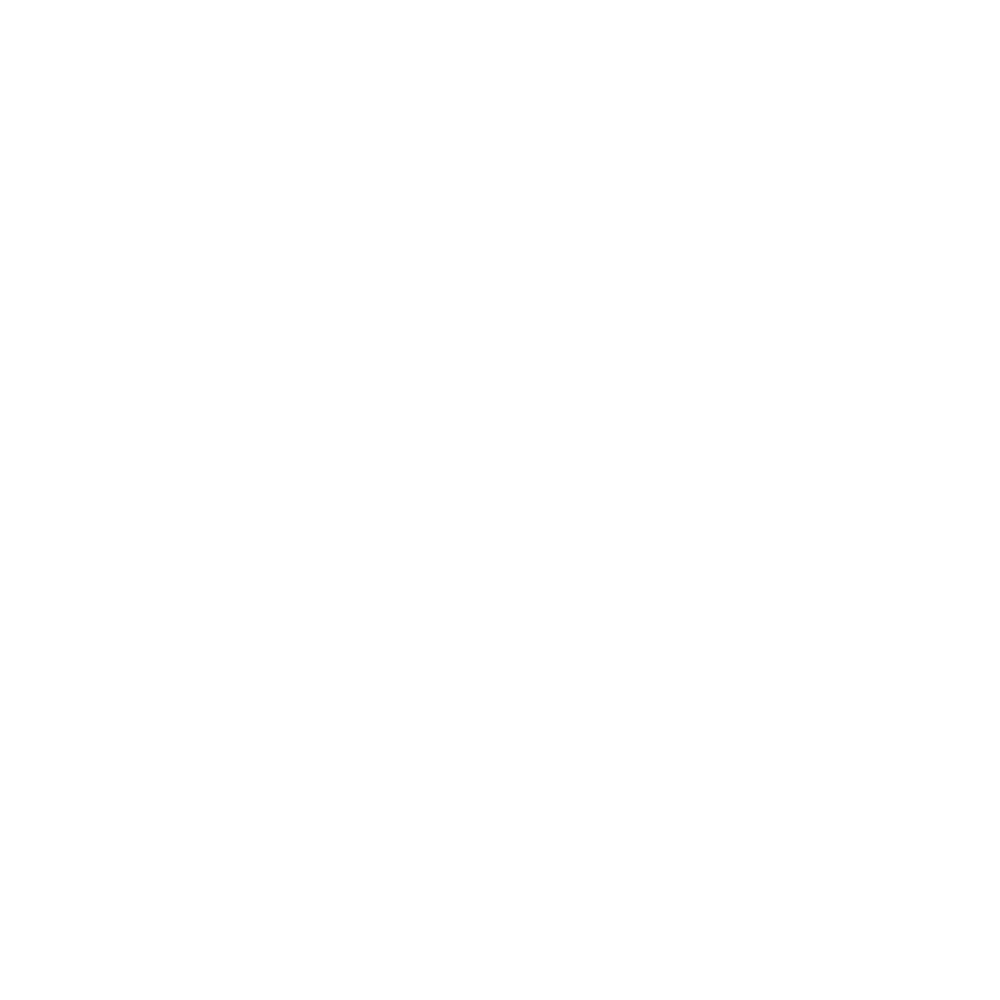

# @$©!! (Semantic Letters + Pixel Edges + Edge Overlay)


A desktop app called @$©!! (ASCII) that converts images into **ASCII art** and **semantic letter-filled renders** (objects filled with characters from their label or a phrase you choose), with **pixelated edge detection** and an **edge overlay** mode.

---

## Overview

This project provides multiple rendering modes:
- **ASCII**: classic grayscale-to-charset text rendering
- **Semantic Letters**: semantic segmentation → fill each object region with characters from the object label (or your replacement phrase / custom character pool)
- **Pixel Edges**: chunky/pixel-style edge detection
- **Edge Overlay**: ASCII base render + pixel edge mask overlaid

Built as a GUI desktop application (Python).

---

## Features

### Modes
- **ASCII**
- **Semantic Letters**
- **Pixel Edges**
- **Edge Overlay**

### Semantic label manager (in-app)
- Detect labels
- Replace label → phrase (e.g., `tree` → `cherry blossom`)
- Hide/delete label regions
- Import/Export label mappings (JSON)

### Rendering controls
- Output width (characters)
- Charset presets or custom charset
- Font selection (monospace recommended), font size, and TTC index support for `.ttc`
- Background options (including **transparent export**, if enabled in your build)
- Color options (depending on your configuration/build):
  - Mono
  - Direct color
  - Reduced palette (e.g., K-means)

### Export
- PNG (supports transparency, if enabled)
- SVG (vector text export, if enabled)
- Copy/save ASCII text

---

## Demo / Screenshots




---

## Installation

### Requirements
- **Python 3.10+** recommended
- Windows 10/11 recommended (macOS/Linux may work but font handling differs)

### 1) Clone the repo
```
git clone https://github.com/theNocturnalG3/Image-to-ASCII-Semantics-Pixelate-.git
cd Image-to-ASCII-Semantics-Pixelate-
```

### 2) Create & activate a virtual environment
**Windows (PowerShell):**
```
python -m venv .venv
.venv\Scripts\activate
```

**macOS/Linux:**
```
python -m venv .venv
source .venv/bin/activate
```

### 3) Install dependencies
```
pip install -r requirements.txt
```

### 4) Run the app
```
python image_to_ascii_app.py
```

---

## Semantic Letters (optional / heavier)

Semantic mode relies on **torch** + **transformers** and a segmentation model (commonly a SegFormer variant via Hugging Face).
- If these dependencies are missing or fail to install, the app should still run, but **Semantic Letters may be disabled**.
- On first use of semantic mode, model weights may download (depending on your setup).

---

## How to Use

1. **Open** an image
2. Choose a mode: **ASCII / Semantic Letters / Pixel Edges / Edge Overlay**
3. Tune parameters:
   - Width (chars)
   - Charset
   - Font + size
   - Color mode
   - Edge settings (threshold / pixel size / thickness)
4. Use **Semantics → Manage labels** (Semantic Letters mode):
   - Replace labels with phrases
   - Hide/delete regions
   - Export/import label mappings
5. **Export** PNG/SVG or copy/save ASCII text

### Character-pool trick (Semantic Letters)
If you replace a label with a phrase, the region is filled using characters from that phrase.
Example:
- `tree` → `t r e T r e` (a custom pool of characters)

---

## Build (Windows EXE) — PyInstaller

Install PyInstaller:
```
pip install pyinstaller
```

Build:
```
pyinstaller --clean --noconfirm @$©!!.spec
```

Notes:
- Packaging semantic mode can make builds **large**.
- Some environments require additional PyInstaller hooks for `torch/transformers`.

---

## Troubleshooting

### Semantic Letters is disabled
Check installs:
```
pip show torch transformers
```
Restart the app after installation.

### Fonts look distorted
Use a **monospace** font (recommended: **Consolas**, Cascadia Mono, Courier New).
If using `.ttc`, try different **TTC Index** values.

---

## License

MIT — see `LICENSE`.

---

## Credits
- UI: PySide6
- Image processing: Pillow, NumPy
- Semantic segmentation: Hugging Face Transformers (SegFormer-family models)
